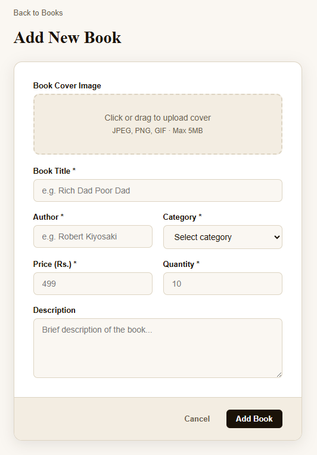
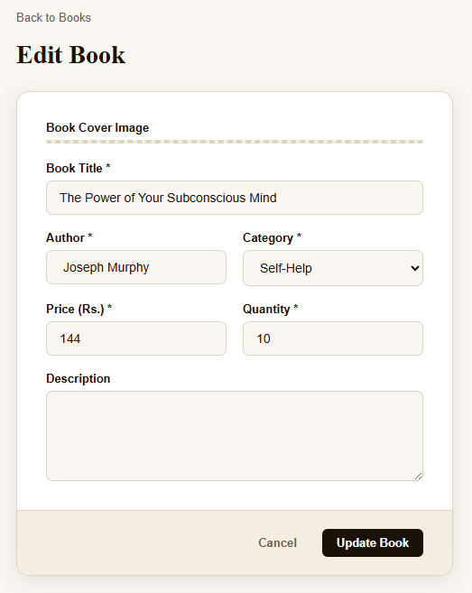
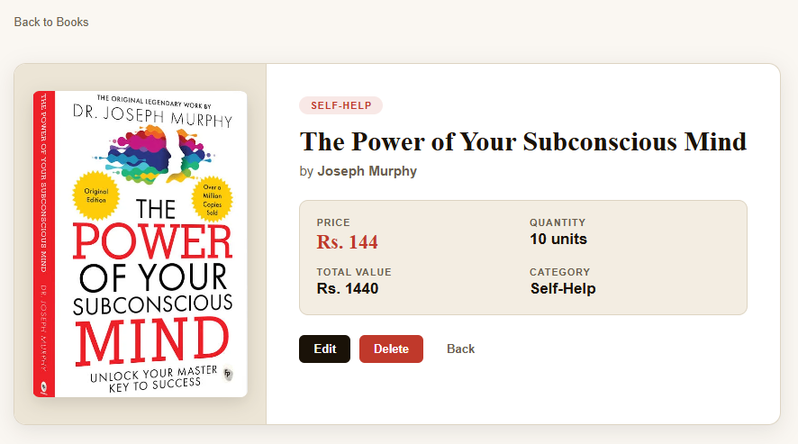

# 📚 BookVault - Book Store Management System

A web-based Book Store Management System built with Node.js, Express, MongoDB, EJS, and Multer. Allows users to manage book records with full CRUD operations and image upload support.

---

## 🛠️ Tech Stack

- **Backend:** Node.js, Express.js
- **Database:** MongoDB, Mongoose
- **Frontend:** EJS, HTML, CSS
- **File Upload:** Multer
- **Fonts:** Google Fonts (Playfair Display, DM Sans)

---

## ✨ Features

- ➕ Add new books with cover image upload
- 📖 View all books in a responsive grid layout
- 🔍 View single book details
- ✏️ Edit existing book information
- 🗑️ Delete books from the database
- 🖼️ Image preview before uploading
- 📱 Fully responsive design

---

## 📸 Screenshots

### Home Page - Book Inventory


### Add New Book


### Edit Book


### Book Detail Page


---

## 📁 Project Structure

```
bookstore/
├── app.js
├── package.json
├── README.md
├── public/
│   ├── css/
│   │   └── style.css
│   ├── js/
│   │   └── main.js
│   └── uploads/
├── views/
│   ├── partials/
│   │   ├── header.ejs
│   │   └── footer.ejs
│   ├── index.ejs
│   ├── add.ejs
│   ├── edit.ejs
│   └── show.ejs
```

---

## ✅ Prerequisites

Make sure you have the following installed:

- 🟢 [Node.js](https://nodejs.org/) v14 or higher
- 🍃 [MongoDB](https://www.mongodb.com/) running locally on port 27017
- 📦 npm (comes with Node.js)

---

## 🚀 Installation

**Step 1 - Clone or download the project**

```bash
git clone https://github.com/your-username/bookstore.git
cd bookstore
```

**Step 2 - Install dependencies**

```bash
npm install
```

**Step 3 - Create the uploads folder inside public if it does not exist**

```bash
mkdir -p public/uploads
```

**Step 4 - Make sure MongoDB is running**

```bash
mongod
```

**Step 5 - Start the server**

```bash
node app.js
```

**Step 6 - Open your browser and visit**

```
http://localhost:3000
```

---

## 📦 Dependencies

| Package | Version | Purpose |
|---|---|---|
| express | ^4.18.2 | Web framework |
| mongoose | ^7.6.3 | MongoDB ODM |
| ejs | ^3.1.9 | Template engine |
| multer | ^1.4.5-lts.1 | File upload handling |
| dotenv | ^16.3.1 | Environment variables |

---

## 🔗 Routes

| Method | Route | Description |
|---|---|---|
| GET | / | View all books |
| GET | /add | Show add book form |
| POST | /add | Save new book to database |
| GET | /show/:id | View single book details |
| GET | /edit/:id | Show edit book form |
| POST | /update/:id | Update book in database |
| GET | /delete/:id | Delete book from database |

---

## 📋 Book Fields

| Field | Type | Required |
|---|---|---|
| title | String | ✅ Yes |
| author | String | ✅ Yes |
| category | String | ✅ Yes |
| price | Number | ✅ Yes |
| quantity | Number | ✅ Yes |
| description | String | ❌ No |
| image | String (filename) | ❌ No |

---

## 🏷️ Available Categories

- Fiction
- Non-Fiction
- Science
- Technology
- Finance
- History
- Biography
- Self-Help
- Children
- Romance
- Mystery
- Philosophy
- Other

---

## 📖 Usage

### ➕ Adding a Book

1. Click the **Add Book** button in the navbar
2. Fill in the book details
3. Upload a cover image (optional)
4. Click **Add Book** to save

### ✏️ Editing a Book

1. Click the **Edit** button on any book card
2. Update the required fields
3. Upload a new image to replace the existing one (optional)
4. Click **Update Book** to save changes

### 🗑️ Deleting a Book

1. Click the **Delete** button on any book card or on the show page
2. Confirm the deletion in the popup dialog

---

## 📝 Notes

- 🖼️ Uploaded images are stored in the `public/uploads` folder
- ✅ Supported image formats are JPEG, PNG, GIF
- ⚠️ Maximum image file size is 5MB
- 🍃 MongoDB must be running before starting the server

---

## 👩‍💻 Author

**Mitali Patel**

---

## 📄 License

This project is for educational purposes.