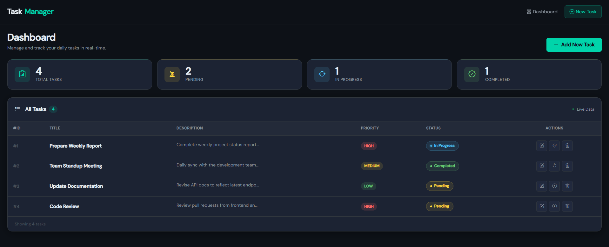
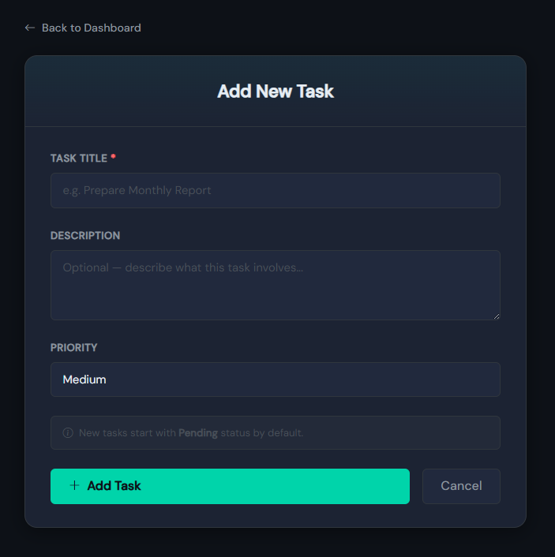
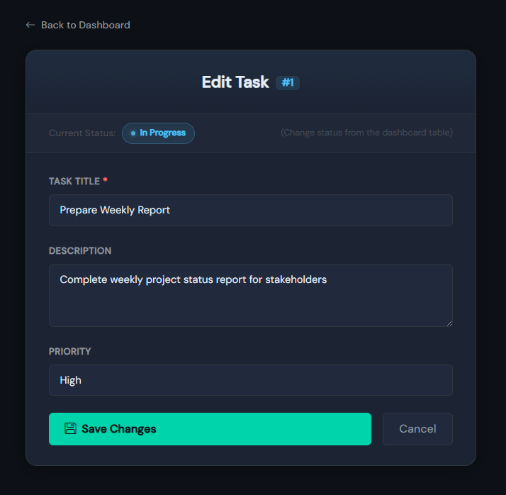

# 🚀 Real-Time Todo Management System

A **modern, professional Todo Management System** built using **Node.js, Express.js, EJS, and Bootstrap** with a **premium dark UI** and real-time styled task updates.

---

## 📌 Project Overview

This application simulates a **real productivity dashboard** where users can:

* ➕ Create new tasks
* 📋 View all tasks in a structured dashboard
* ✏️ Edit existing tasks
* 🗑️ Delete tasks
* 🔄 Update task status (Pending → In Progress → Completed)

All operations are handled dynamically using **server-side rendering (EJS)** and **in-memory storage**.

---

## 🛠️ Tech Stack

* ⚙️ Backend: Node.js + Express.js
* 🎨 Frontend: EJS Templates
* 💅 UI Framework: Bootstrap (Offline)
* 🎯 Icons: Bootstrap Icons
* ✍️ Fonts: Google Fonts (Syne + DM Sans)
* 📦 Storage: Local Array (No Database)

---

## ✨ Key Features

### 📊 Dashboard

* Real-time task statistics:

  * Total Tasks
  * Pending Tasks
  * In Progress Tasks
  * Completed Tasks
* Responsive task table
* Empty state UI when no tasks exist

---

### ➕ Task Management

* Add new task with:

  * Title
  * Description
  * Priority (Low / Medium / High)
* Default status: **Pending**

---

### ✏️ Edit Task

* Pre-filled form
* Update title, description, priority
* Clean UI with status indicator

---

### 🔄 Task Status Flow

* Pending → In Progress → Completed → (loop reset)
* Animated status indicators

---

### 🗑️ Delete Task

* Confirmation popup before deletion
* Instant UI update

---

### 🎨 UI/UX Highlights

* 🌙 Premium Dark Theme
* 🎯 Glassmorphism Navbar
* 📦 Card-based layout
* ✨ Hover effects & animations
* 📱 Fully responsive design
* 🔔 Auto-dismiss alerts

---

## 📁 Project Structure

```
TodoApp/
│── views/
│   ├── partials/
│   │   ├── header.ejs
│   │   ├── footer.ejs
│   │
│   ├── dashboard.ejs
│   ├── add-task.ejs
│   ├── edit-task.ejs
│
│── public/
│   ├── css/
│   │   ├── bootstrap-icons.min.css
│   │   ├── bootstrap.min.css
│   │   └── style.css
│   │
│   ├── js/
│   │   └── bootstrap.bundle.min.js
│   │
│   ├── fonts/
│   
│
│── app.js
│── package.json
```

---

## ⚙️ Installation & Setup

### 1️⃣ Clone the repository

```bash
git clone <your-repo-url>
cd TodoApp
```

### 2️⃣ Install dependencies

```bash
npm install
```

### 3️⃣ Run the server

```bash
npm start
```

### 4️⃣ Open in browser

```
http://localhost:3001
```

---

## 🧠 How It Works

* Tasks are stored in a **local array**
* Each task has:

```js
{
  id,
  title,
  description,
  priority,
  status
}
```

* Express routes handle:

  * GET → Render pages
  * POST → Perform CRUD operations

* EJS dynamically updates UI based on data

---

## 🎯 Core Modules

| Module         | Description                      |
| -------------- | -------------------------------- |
| Dashboard      | Displays statistics + task table |
| Add Task       | Form to create new tasks         |
| Edit Task      | Update existing task             |
| Delete Task    | Remove task                      |
| Status Manager | Controls task lifecycle          |

---

## 🔥 Advanced UI Features

* 🎨 CSS Variables for theme control
* 💡 Animated status indicators
* 🧩 Modular EJS partials (header/footer)
* 🧠 Smart alerts system
* 🖱️ Hover interaction effects

---

## 📸 Screenshots

### 📊 Dashboard



### ➕ Add Task


### ✏️ Edit Page



---

## 🚀 Future Enhancements

* 🔍 Search & Filter tasks
* 📄 Pagination
* 💾 JSON / Database storage (MongoDB)
* 👤 User Authentication
* 🌐 API Integration
* 🌙 Light/Dark toggle

---

## 🎓 Learning Outcomes

* Understanding of **MVC-like structure**
* Hands-on with **Express routing**
* Dynamic UI using **EJS templating**
* Real-world **CRUD operations**
* UI design with **Bootstrap + Custom CSS**

---

## 👨‍💻 Author

**Mitali Patel**