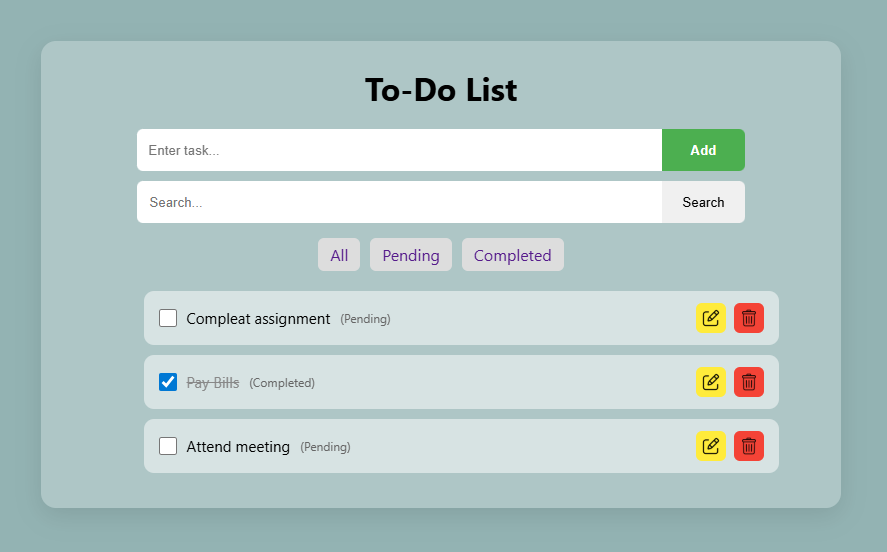
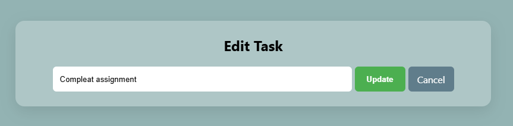

# 📝 To-Do List App (Node.js + Express + EJS)

A simple and clean **To-Do List Web Application** built using **Node.js**, **Express.js**, and **EJS**.
This app allows users to manage daily tasks with features like adding, editing, deleting, searching, and filtering tasks.

---

## 📸 Screenshots

### 🏠 Home Page



### ✏️ Edit Page



---

## 🚀 Features

✔ Add new tasks
✔ Edit existing tasks
✔ Delete tasks
✔ Mark tasks as Completed / Pending
✔ Search tasks
✔ Filter tasks (All / Pending / Completed)
✔ Clean and responsive UI

---

## 🛠️ Technologies Used

* Node.js
* Express.js
* EJS
* HTML5
* CSS3

---

## 📁 Project Structure

```
To-Do-App/
│
├── public/
│   ├── style.css
│   ├── icons/
│   │   ├── edit.png
│   │   └── recycle-bin.png
│   └── screenshots/
│       ├── home.png
│       └── edit.png
│
├── views/
│   ├── index.ejs
│   └── edit.ejs
│
├── app.js
└── package.json
```

---

## ⚙️ Installation & Setup

1. Clone the repository

```
git clone https://github.com/your-username/todo-app.git
```

2. Navigate to project folder

```
cd todo-app
```

3. Install dependencies

```
npm install
```

4. Run the server

```
node app.js
```

OR (if using nodemon)

```
npx nodemon app.js
```

---

## 🌐 Run the App

Open your browser and go to:

```
http://localhost:8000
```

---

## 📌 How It Works

* Tasks are stored in an **array (in-memory)**
* Each task contains:

  * `text` → task name
  * `completed` → status (true/false)

---

## 🔗 Routes

| Method | Route         | Description        |
| ------ | ------------- | ------------------ |
| GET    | `/`           | Display all tasks  |
| POST   | `/add`        | Add new task       |
| GET    | `/delete/:id` | Delete task        |
| GET    | `/edit/:id`   | Open edit page     |
| POST   | `/update/:id` | Update task        |
| POST   | `/toggle/:id` | Toggle task status |

---

## 🔍 Features Explanation

### ➕ Add Task

Enter a task and click **Add** to save it.

### ✏️ Edit Task

Click the edit icon to update a task.

### ❌ Delete Task

Click the delete icon to remove a task.

### ✔ Toggle Status

Checkbox changes task between **Completed** and **Pending**.

### 🔍 Search

Search tasks by typing keywords.

### 🎯 Filter

* **All** → Show all tasks
* **Pending** → Show incomplete tasks
* **Completed** → Show finished tasks

---

## ⚠️ Limitations

* Data is stored in memory (resets when server restarts)
* No database integration
* Uses GET request for delete (for simplicity)

---

## 💡 Future Improvements

* Add database (MongoDB / MySQL)
* Add user authentication
* Add task priority & due dates
* Improve UI/UX
* Add animations

---

## 🎓 Conclusion

This project demonstrates CRUD operations using Node.js and Express.
It helps understand how backend and frontend work together in a simple application.

---

## 🙌 Author

**Mitali Patel**

---

⭐ If you like this project, give it a star!
